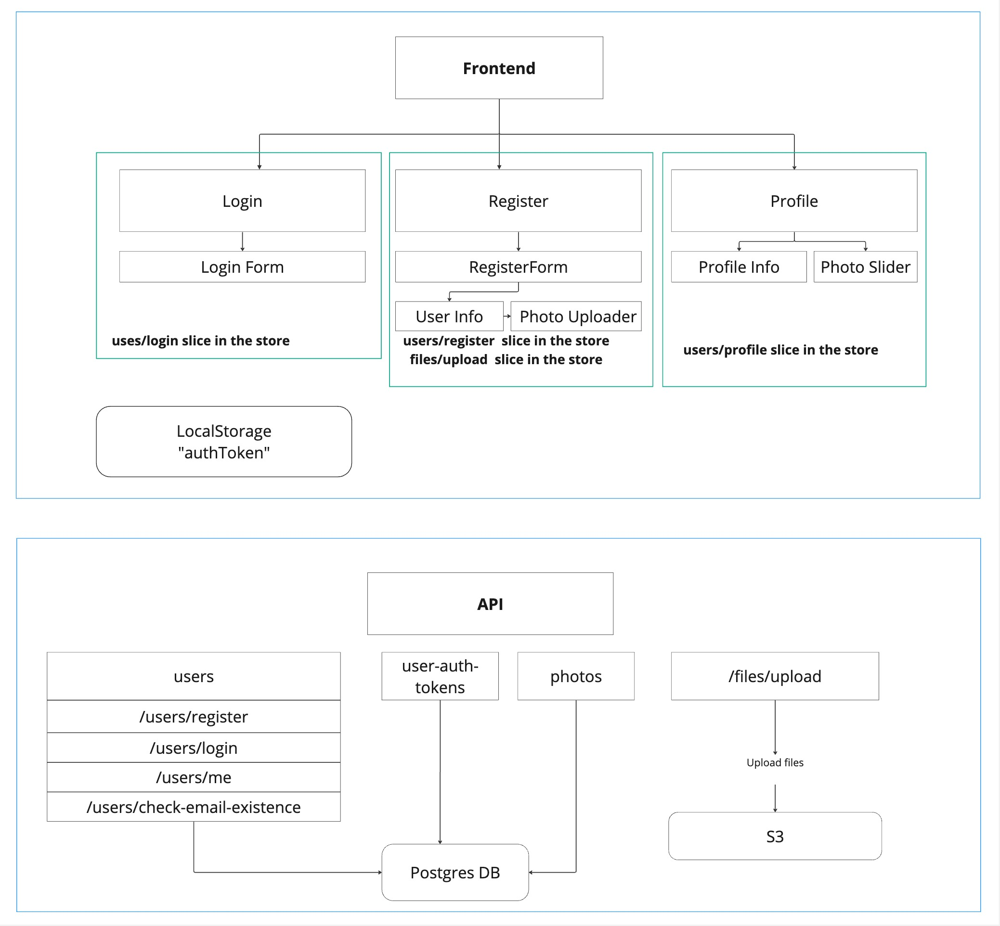
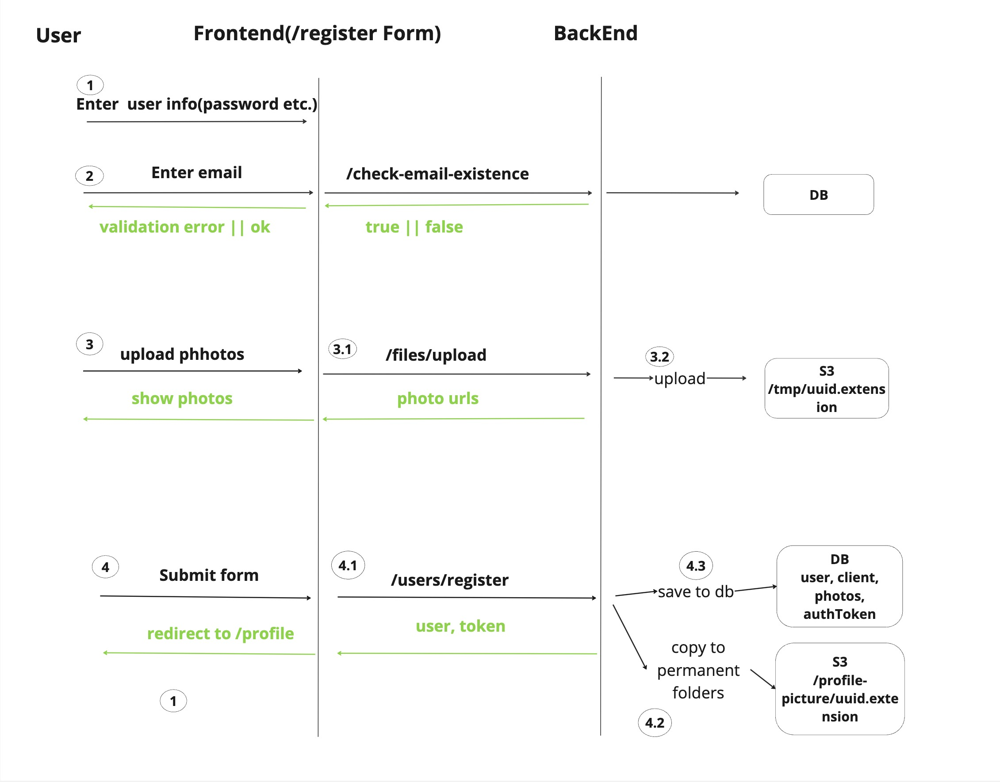

# The auth task Design document

This document includes high level design of the system, it's component and the most important flows to understand the system.

### High Level System Components

In the picture you can find high level components of **Frontend** and **API**.

### Backend

Uses **PostgresQL** as database, **S3** as media storage and **express.js** as http server management library.
API Includes the following endpoints.

- **[POST] /users/register**
- **[GET] /users/login**
- **[GET] /users/me**
- **[POST(multipart/form-data)] /files/upload**
- **[Get] /files/upload/configuration** - returns configuration(maxFileSize, maxFileCount etc.)

### Frontend

Uses **Next.JS** client side rendering, **Redux Toolkit Query**, **shadcn-ui** and **LocalStorage** to store authentication token.
Includes the following pages

- **register**
- **login**
- **profile**

### Registration flow

Here is a visual representation of the registration flow, below find explanation.

1. User enter user information (First Name, Last Name, Password, Confirm Password, Email) as a first step of the form
2. __THIS PHASE IS OPTIONAL AND NOT USED IN THE FRONT END IMPLEMENTATION__ - While entering email, the front end does a request to the backend `/users/check-email-existence` to show the email is available or not, if its not available shows an error
3. As a second step of registration form, user asked to upload profile photos and avatar.
   When the user uploads the image as avatar or images as photos, the frontend does request to the `/files/upload`.
   - (3.1) The backend receives the images or image, passes through custom middleware to get blob from stream
   - (3.2) The backend stores images into the s3 /tmp folder and returns unique keys and locations for images
4. User submit the form to create account and sends the request to `/users/register` with profile info, avatarKey, and photo keys
   - (4.1) The back-end receives the request, creates the user, client, auth-token, photos and stores into the database marked as (4.3) step
   - (4.2) The back-end sends the request to s3 to copy objects from `/temp` to `/profile-pictures` | `/avatars` folders provided by the user as photo keys
     And returns the user object with auth-token and photo urls

File uploading system, optimizes the need of having media storage for client side that can be used anytime as a temporary storage, and if the keys of temporary storage is being used, they need to be moved to the persistent folders

**Note**
_What makes s3 folders persistent or temporary ?
If the folder name is `/temp` that means the objects inside the folder are temporary and might be deleted within 10 | 20 | 30 minutes.
How the detection process goes. Each object in s3 has last modified key, and if the object is copied that will have updated modification data. So if the AWS cron identifies the object has not modified for the last 10+ minutes, it will be removed._
